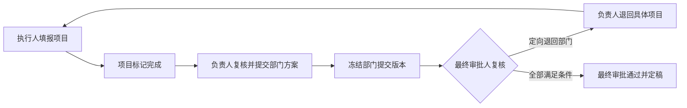

# 登录与权限方案 V1（评审稿）

日期：2026-09-21。范围：资源投资规划工作台的一期登录、角色授权、数据范围及审批边界。本文件是方案，不代表功能已实现或数据库已迁移。

## 1. 结论与需求口径

采用“邮箱账号 + 四类角色 + 权限配置 + 部门/项目范围 + 流程状态校验”。管理员管理人员与授权；执行人填报；负责人复核并提交部门方案；大老板最终审批。

权限使用配置表，但不要在用户表中用单个 `permission=0/1/2` 表达所有权限。一个人可能同时有多个权限、负责多个范围，单个数字无法清楚表达。

### 已确认的新要求

- 本阶段不接 SSO，账号使用邮箱。
- 第一版使用预登记邮箱直接登录，不设置密码、默认密码或验证码；用户已明确选择此方式，并要求标明可被冒用的限制。
- 角色包括管理员、部门负责人、部门执行人、最终审批人（大老板）。
- 管理员可分配权限，且自己拥有所有业务权限。
- 具体权限仍需规划；当前先形成方案。
- 执行人按项目分工，只能填写本人负责的 Initiative（本轮已再次确认）。
- 近期由业务人员正式填报真实数据，不是仅内部演示（本轮已再次确认）。

### 本方案建议，尚不是业务确认

- 同部门执行人不互改；用项目 Owner 归属落实已确认的本人填写边界。
- 部门负责人默认复核、退回、提交，不直接改执行人的分配；兼任执行人时，可编辑自己负责的项目。
- 大老板默认看部门提交快照，不看尚未提交的工作草稿。
- 一期采用固定的“执行人 → 部门负责人 → 最终审批人”流程，不引入审批流程设计器。
- 管理员可代填、代提交、代审批，但应用内必须记录当前管理员登录账号及操作原因；所有人都遵守版本锁定和业务校验。

以上建议可在评审中调整，不据此直接修改数据库或现有业务代码。

## 2. 原型与现有项目核对

参考：`D:\work\Develop\资源投资原型\演示与开发说明_V1.3.md`、`src/engine.js`、`src/explore.js`、`src/app.js`。

| 项目 | 已核实的现状 | 对方案的影响 |
| --- | --- | --- |
| 原型角色 | owner、lead、management、admin | 可分别映射到执行人、负责人、最终审批人、管理员 |
| 原型项目归属 | 每个 Initiative 有 ownerId，执行人只能操作本人项目 | 需要用户与预算项目的归属关系 |
| 原型审批 | 项目完成 → 部门提交快照 → 管理层退回或定稿 | 审批对象应是某个提交版本，不是不断变化的草稿 |
| 原型管理员 | 维护预算、Owner、参考数据和指南，不能代改分配 | **按本次新要求改为拥有全部业务权限**，保留版本锁定 |
| 原型人员管理 | 人员与权限页面展示权限说明，Owner 是模拟编号 | 不能当作已经实现的人员授权管理功能 |
| 后端身份 | `dependencies/workbench_user.py` 固定返回 user-a / MKT / PCMO | 需替换为由登录会话解析的真实应用用户 |
| 后端数据范围 | `BudgetRepository` 按年度、department、sector 过滤；BudgetDO 尚无 Owner 字段 | 当前不足以区分同部门的两个执行人 |
| 后端 SSO | `require_sso_principal()` 为返回 501 的占位；未接入供应商 | 本次采用邮箱登录入口，复用业务层，不必先完成 SSO |
| 前端 | `WorkspaceContext.tsx` 使用 localStorage；部门选择只是页面状态 | 需接入后端当前用户及授权数据，前端选部门不构成权限 |
| 开发约定 | Controller → Service → Repository → DO；响应为 `{code,msg,data}`；已有 Alembic 目录 | 后续沿用，不新增另一套接口响应规范 |

当前 React 项目和 V1.3 单文件原型不是同一套实现。原型提供业务边界，现有 React/FastAPI 项目是后续落地位置；不能认为复制角色切换控件即可完成鉴权。

## 3. 登录边界：邮箱是账号，验证方式独立选择

### 3.1 第一版已选定：预登记邮箱直接登录

用户已明确：近期用于真实数据填报，但暂时仍按邮箱直接登录规划，并标明可被冒用的限制。依此确定一期范围，不再把密码或验证码作为本方案推进的前置条件。

1. 管理员预先登记邮箱、姓名、部门及角色，并启用账号。
2. 用户输入邮箱，后端仅查找是否为已登记且启用的账号；符合条件即创建应用会话。
3. 后端从账号及会话读取角色、部门和项目范围；登录请求只收邮箱，不能接受调用方自报角色。
4. 未登记/停用账号不能进入；已启用但尚未授权的账号只展示“请联系管理员分配权限”。不默认给全局或部门权限，也不自动注册。
5. 邮箱去除首尾空格并按约定小写匹配，唯一性在后端执行；修改账号邮箱仅由管理员办理，并撤销其旧会话。

建议配置模式名为 `email_only`。第一版不建密码字段、不生成默认密码、不接邮件通道、不建设验证码接口。

### 3.2 已接受的能力限制

直接输入邮箱不能证明输入人拥有该邮箱。知道他人已登记邮箱的人可以以该账号进入，包括管理员或最终审批人。账号白名单、会话 Cookie 和接口权限检查都不能消除这种冒用。

因此，本方案中的权限判断是“这个登录账号可以做什么”，操作/审批日志记录的是“哪个登录账号做过什么”，**不能据此证明实际自然人身份，也不能当作可靠的个人签核证明**。界面使用简短说明，例如“当前使用邮箱直接登录，尚未验证邮箱身份”。日志记录登录模式，便于区分未来启用身份验证后产生的记录。

这项限制已向用户说明，用户明确选择暂按此方式规划；本轮不另设批准流程。后续如需可信个人身份，可替换为邮箱验证码、独立密码或 SSO，继续复用用户 ID、角色、Owner 及审批模型。

### 3.3 无论采用哪种登录，都复用同一会话与权限链路

- 后端签发不可预测的会话标识，浏览器通过 HttpOnly Cookie 使用；部署环境启用 HTTPS/Secure，并按前后端部署方式设置 SameSite、CORS 与写请求 CSRF 防护。
- 会话有效期可配置，建议一期工作日内有效，例如 8 小时；退出/停用账号后失效。
- 服务端保存会话标识的摘要及用户关联，不在 Cookie 或 localStorage 中保存可修改的角色授权依据。
- 一期每次请求读取当前有效授权，权限变更从下一次请求生效；以后如加缓存，必须有失效机制。敏感写操作在提交事务前再次检查有效身份与授权。
- 登录请求限流，不在登录页提供账号目录，不记录会话原文；这些措施不改变邮箱可被冒用的限制。
- 初始管理员通过受控初始化脚本或部署步骤创建，不采用“第一个登录的人自动成为管理员”。禁止停用/降级最后一个有效管理员。
- 以后接 SSO 时，将通过验证的外部身份绑定到现有 user_id，业务权限与项目归属继续复用；不按浏览器声称的邮箱自动合并身份。

## 4. 权限判断分四层

判断规则：有效账号与会话 AND 操作权限 AND 数据范围 AND 业务状态。第一版的“有效会话”不表示邮箱身份已经验证。

- **页面**：能否看到工作台、部门总览、最终审批、管理后台入口。
- **操作**：能否查看、编辑、导入、导出、退回、提交、定稿。
- **数据**：自己的项目、某个部门、全公司有效提交，或管理员全局。
- **状态**：是否已完成、已提交、被退回、已定稿；是否仍为当前修订号。

页面和按钮由前端改善体验；后端检查每次读取和写入。列表、详情、搜索、统计、图表、导出、下载、批量导入、Insight 和问数必须使用同一套范围规则。

**特别注意多角色合并**：合并“权限 + 对应范围”这一对授权，不能分别合并权限列表与部门列表后自由组合。例如某人是 MKT 负责人、ICE 执行人，他可以查看 MKT 全部项目，但只能编辑本人负责的 ICE 项目，不能因为有编辑权限就编辑 MKT 全部门。

## 5. 默认角色权限矩阵

下表是一期默认值。“本人”指当前被分配为 Owner 的项目，不等于自己创建的记录；“部门”指被管理员授予对应角色的部门。

| 功能 | 管理员 | 部门负责人 | 部门执行人 | 最终审批人 |
| --- | --- | --- | --- | --- |
| 人员、角色与授权维护 | 全部 | 无 | 无 | 无 |
| 部门、预算上限、项目归属维护 | 全部，受锁定规则约束 | 查看本部门 | 查看本人项目 | 查看提交版本 |
| 查看分配工作草稿 | 全部 | 本部门 | 本人项目 | 无 |
| 编辑分配/业务说明/预算池 | 全部可编辑项目 | 默认无 | 本人可编辑项目 | 无 |
| 分配 Excel 导入 | 全部可编辑项目 | 默认无 | 本人可编辑项目 | 无 |
| 标记完成/重新编辑 | 全部可编辑项目 | 默认无 | 本人项目，受状态约束 | 无 |
| 查看部门固定汇总 | 全部 | 本部门 | 本部门固定汇总 | 已提交部门汇总 |
| 退回具体项目给执行人 | 全部未锁定部门 | 本部门 | 无 | 通过退回部门提出意见 |
| 复核并提交部门方案 | 全部 | 本部门 | 无 | 无 |
| 查看提交版本 | 全部 | 本部门 | 当前有权项目的裁剪明细 | 全公司提交版本 |
| 退回部门方案 | 全部 | 无 | 无 | 已提交部门 |
| 最终审批并定稿 | 有 | 无 | 无 | 有 |
| 生成/查看完整 Insight | 所有授权分析范围 | 本部门 | 仅状态，无完整部门内容 | 全局有效提交范围 |
| 编辑分析提示词 | 所有范围 | 本部门 | 无 | 全局 |
| 维护公共分析指南/参考批次 | 有 | 无 | 无 | 无 |
| 查看历史 Vol/C3/整体 Yield | 共享只读 | 共享只读 | 共享只读 | 共享只读 |
| 查看历史资源明细 | 全部 | 部门授权类型 | 部门授权类型 | 全部 |
| 导出 | 全部授权数据 | 本部门授权数据 | 本人及明确共享的数据 | 提交版本及授权历史 |
| 查看操作记录 | 全部 | 本部门业务记录 | 本人项目相关记录 | 提交与总审批记录 |

“所有权限”不表示能改写已提交快照或绕过金额校验。管理员可在流程允许时代执行；已提交先退回，已定稿版本保持不变。管理员代操作记录当前管理员账号 user_id、目标项目/部门、动作、原因、前后版本，应用不能把这次操作的归属账号改写为执行人或大老板。邮箱直接登录仍可能被人冒用，日志归属账号不等于已验证的自然人。

执行人所填的“配置”在本方案中指本人项目的分配金额、业务说明、预留及非经销商安排。用户授权、预算总额、公共规则和 Owner 归属属于管理配置，不因拥有填报权限自动开放。

负责人兼任执行人时，默认允许填写其本人项目并提交所在部门方案，但不能做最终审批。一期未假定必须“经办人与部门复核人不同”；如果客户要求这一点，需要单独增加职责分离规则。管理员依新要求允许覆盖各业务角色，其代理操作始终留痕。

## 6. 数据范围的明确边界

### 6.1 部门与项目

- 默认每个项目只有一名当前执行人；同部门可有任意数量执行人，不能把原型中的每部门两人写死。
- 负责人可看本部门全部项目；执行人只能打开本人项目。执行人可以看固定的部门预算/完成率汇总，不能从该汇总钻取同事项目明细。
- 部门汇总允许别人估算“其他人的合计”，这是显式共享的聚合信息，不应宣称它完全隐藏同事的金额信息。
- 无 Owner 的项目只出现在管理员/负责人待分配列表，执行人看不到，也不能完成部门提交。
- Owner 转交后旧执行人立即失去该项目当前及历史访问权；新执行人可看该项目历史。历史快照保留当时 Owner 和操作者，但历史展示仍先检查当前授权。
- 移除某人的执行人角色或停用账号前，应提示并处理其未结束项目的交接；不得留下无人处理的项目。紧急停用允许先停用，但相关部门提交应被未有效分配项目拦截。
- 部门内转交可由管理员办理；已提交项目先退回才改变归属，已定稿快照不回写。跨部门转移不作为普通 Owner 调整，涉及预算归属与审批范围，应单独确认后办理。
- 用户可以有多条角色授权，例如管理两个部门。前端只列出后端返回的合法部门，部门切换只是选择授权范围。
- 原型中的 MKT、ICE、CAPEX 是演示值，部门来自配置表。现有前端 Capex 与原型 CAPEX 的大小写差异，在迁移时明确映射。
- Sector 暂作为业务筛选维度，不根据现有固定 PCMO 身份自动认定它是权限边界。若同部门还需按 Sector 隔离，后续在授权中增加该维度并重新评审。

### 6.2 提交版本与历史参考

- 最终审批人的默认工作对象是当前有效的部门提交快照；未提交部门仅展示必要状态和覆盖率，不混入草稿金额。
- 被退回的旧版本可供负责人、最终审批人和管理员追溯，但标识为失效；不能继续参与当前汇总或定稿。
- 最终审批人可查看提交时冻结的分析与依据；如生成新全局分析，明确其使用的部门版本和参考批次，不能改写原快照。
- 沿用原型建议：历史 Vol/C3/整体 Yield 共享只读；部门历史资源类型按部门资源授权映射过滤。MKT→MRD/SP&A、ICE→ICE Rebate、CAPEX→Capex 只是当前原型初始配置示例。
- 原型同时共享 C3 和 `Yield=C3/总资源`，使用者可以反推近似总资源。因此“页面不展示总资源”只是展示边界，不能承诺总资源数值不可推算；若总资源必须保密，需要调整这项共享口径。
- 执行人不接收可能引用同事明细的部门完整 Insight、部门提示词和部门提交自由文本；只接收必要状态及本人项目相关反馈。
- AI/问数由后端提取授权数据后调用，不能把全公司数据发送到前端或模型后，再靠提示词要求隐藏。对话、缓存、导出文件按用户和授权范围隔离，权限变化后重新校验。

## 7. 审批及锁定规则

### 7.1 建议保留的简单流程

部门负责人在提交前也可将项目退回执行人。这里的“部门审核通过”体现为“复核并提交”一个动作；大老板的“审批通过”体现为最终定稿，一期不额外发明多级会签。

### 7.2 状态拆开存储

| 对象 | 建议状态 | 说明 |
| --- | --- | --- |
| Initiative 工作稿 | 编辑中、已完成 | 现有预算 status=0/1 可先保留该含义，不混入部门审批状态 |
| 部门方案 | 草稿、已提交、已退回、已定稿 | 按规划年度/轮次和部门区分，并关联当前有效提交版本 |
| 全局规划轮次 | 进行中、已定稿 | 冻结本轮参与审批的部门清单及最终采用的版本 |

具体边界：

1. 保存草稿可有未分配差额；标记完成时校验金额、说明、预算平衡等业务规则。重新编辑会撤销完成状态。
2. 所有本轮有效项目都有有效 Owner、已完成并通过校验后，负责人才能提交本部门。多个部门可独立提交。
3. 提交时创建不可覆盖的快照，记录预算、分配、当时 Owner、参考批次、指南/提示词版本及分析依据；同时锁定部门草稿的预算和分配。
4. 原型中 Insight 不是提交硬门槛，建议保留；无分析或分析过期时提示并记录，不擅自增加“必须生成 AI 才能提交”。
5. 大老板退回部门必须写原因，旧快照保留，当前有效版本撤销；其他部门不受影响。
6. 负责人把需处理的意见关联到具体项目，再由对应执行人复核完成。被退回问题全部有处理结果后才能重提；重提产生新版本，不能原地覆盖旧版。
7. 所有“本规划轮次应提交部门”都有有效版本才能定稿。应提交部门不是固定三个，也不是简单取所有启用部门；在轮次启动时明确，避免组织变更无意改变审批门槛。
8. 沿用原型的最终校验：各有效部门提交使用一致的参考数据批次；不一致时退回受影响部门重新复核提交，不能偷偷替换提交依据。
9. 定稿记录采用的每个部门版本，之后预算、分配和旧快照不能直接修改。定稿后调整应建立新轮次/修订流程，一期不提供通用“管理员强制解锁”。
10. 提交、退回、定稿以及修改/导入采用数据库事务和版本检查。重复审批不产生第二份有效结果；过期版本返回冲突，要求刷新。

一个部门有多名负责人时，建议一期“任一具备该部门提交权限的负责人可操作”，不是必须全部会签；多人同时提交只允许一个成功。审批待办根据当前有效授权解析，不能永久绑死已离岗人员。

## 8. 权限配置如何存储

### 8.1 六张核心表

以下是逻辑表设计，命名供评审；不是可直接执行的 DDL。

| 表 | 最小关键字段 | 用途 |
| --- | --- | --- |
| users | id、email、display_name、is_active、created_at、updated_at | 应用用户；邮箱标准化后唯一；用户 ID 不随邮箱变动 |
| departments | id、code、name、is_active | 部门字典，code 唯一，不硬编码原型部门 |
| roles | id、code、name、is_builtin | 初始化 ADMIN、DEPT_LEAD、EXECUTOR、FINAL_APPROVER 四个角色 |
| permissions | id、code、name、module | 系统支持的操作字典，如 allocation.edit、plan.finalize |
| role_permissions | role_id、permission_id、scope_type | 一个角色在何种范围内拥有某项操作 |
| user_role_assignments | id、user_id、role_id、department_id | 把角色授予用户，并绑定部门；全局角色 department_id 为空 |

建议一期范围值只实现必要的几种：`OWNED`（本人项目）、`DEPARTMENT`（指定部门明细）、`DEPARTMENT_SUMMARY`（固定部门汇总）、`SUBMITTED`（全局提交版本）、`ALL`（全局）、`SHARED`（明确共享指标）。历史资源明细另按部门资源映射裁剪字段。

范围不能随意搭配权限。例如 allocation.edit 不接受 SUBMITTED，部门角色不能通过配置拿到 ALL；scope_type 只能从后端为该权限和角色允许的选项中选择。SHARED 也必须指向明确的共享数据投影，不代表全部数据。

初始化示例：

| 角色 | 权限 | 范围 |
| --- | --- | --- |
| EXECUTOR | allocation.view / allocation.edit / allocation.import / initiative.complete | OWNED |
| EXECUTOR | department.summary.view | DEPARTMENT_SUMMARY |
| DEPT_LEAD | allocation.view / initiative.return / department.submit | DEPARTMENT |
| FINAL_APPROVER | submission.view / department.return / insight.view / insight.generate | SUBMITTED |
| FINAL_APPROVER | plan.finalize | SUBMITTED（仍校验本轮全部必需部门及状态） |

用户 A 的角色授权为 `(EXECUTOR, MKT)`，同时预算项目 101 的 owner_user_id=A，A 才能修改项目 101。用户 B 的 `(DEPT_LEAD, MKT)` 则允许复核和提交 MKT。两项条件不是同一件事。

### 8.2 必要的业务关联与运行支持

- 现有 `data.budgets` 增加 owner_user_id，建议同时增加 revision 用于并发检查。可先允许空 Owner 完成存量迁移，再分配；未分配时不对执行人开放。
- 部门表与现有 budgets.department 先通过唯一 code 对齐；清理大小写和未知部门后建立引用约束。不应在权限改造中未经核对直接重写现有预算关联键。
- `user_role_assignments` 用于表达用户有效部门资格，用户表不再重复保存另一份可冲突的“授权部门列表”。
- `department_resource_types` 维护部门可见的历史资源类型。若项目已有对应字典则复用；不要把原型映射写成程序内固定条件。
- `user_sessions` 保存用户、会话摘要、过期时间和撤销状态；采用第 3 节建议的服务端会话时需要。
- 一期不建密码凭据或验证码表。会话及操作日志保存登录模式 `email_only`，避免未来把未验证身份的历史记录解释为已经验证的个人签核。
- 复用或补充通用审计记录，记录当前登录账号、动作、对象、时间、原因、授权变更前后值及请求关联 ID。现有 budget_change_logs 仅承担预算类日志，不能冒充完整的登录/授权/审批审计。
- 审批的规划轮次、部门方案、提交快照、最终版本引用和退回记录属于业务流程模型，实施审批阶段再落表，不塞进用户权限表，也不加到 budgets.status 一个字段里。
- role_permissions 的组合唯一；部门授权防重复，全局授权也防重复（PostgreSQL 中需专门处理 department_id 为空时的唯一性）。按 user_id、部门和 owner_user_id 建立必要查询索引。

### 8.3 关于“0 表示所有权限”

数据库主键用 0、1、2 或其他整数均可，但程序不要依赖这些数字的大小或连续性来判断权限。

建议通过内置 `ADMIN` 角色明确表达超级管理员。后端只有识别到有效的 ADMIN 全局授权时，才放行操作权限与数据范围；之后继续执行状态、版本、参数及业务校验。不要另加一个可与角色配置冲突的用户 permission=0 字段。

普通角色通过关联表绑定权限。权限编码可读且稳定，例如 `allocation.edit`，前端展示中文“编辑项目分配”。没有配置的权限默认拒绝。

权限字典由开发随功能发布维护；管理员可分配角色，并在允许范围内调整普通角色已有权限。**在表里新增一个权限名称不会自动创造新功能或后端校验**。一期不做任意脚本、任意条件表达式、用户直接授权例外或无限层级角色继承。

## 9. 第一版权限清单

| 业务模块 | 建议权限编码 | 边界 |
| --- | --- | --- |
| 系统管理 | user.manage、role.assign、role.permission.manage、department.manage | 一期仅管理员；不可移除最后一个管理员 |
| 预算与归属 | budget.view、budget.manage、initiative.assign | 预算上限和 Owner，不等同于分配填写 |
| 业务填报 | allocation.view、allocation.edit、allocation.import、initiative.complete | 分配行、金额、说明及重新编辑，均须对象范围与状态校验 |
| 部门复核 | department.summary.view、initiative.return、department.submit | 指定部门的汇总、项目退回、复核提交 |
| 总审批 | submission.view、department.return、plan.finalize | 某个有效部门版本或最终版本集合 |
| 分析 | insight.view、insight.generate、analysis_prompt.manage、analysis_guide.manage | 部门/全局分开，指南维护是管理员权限 |
| 历史参考 | reference.shared.view、reference.resource.view、reference.manage | 共享指标、授权资源列、参考批次维护分开 |
| 导出与追溯 | data.export、audit.view | 必须同时拥有源数据读取权，导出不能扩大可见范围 |

导入必须同时满足目标数据的写权限，不能单凭“有导入按钮权限”批量覆盖别人项目。导出或快照下载同样不能绕过行、字段和版本范围检查。

## 10. 页面与接口落地建议

### 页面

- 登录页：邮箱输入、当前登录模式说明及错误反馈。正式验证模式再增加相应验证步骤。
- 执行人工作台：本人项目、完成进度、本人待处理反馈；仅可查看固定部门汇总。
- 部门负责人工作台：本部门总览、项目复核、退回、部门 Insight、提交历史。
- 最终审批工作台：各部门有效提交、版本比较/查看、退回、最终定稿；显示已提交覆盖率。
- 管理后台：人员管理（邮箱/姓名/启用状态）、角色与部门授权、项目 Owner 分配、普通角色权限矩阵、预算/参考/分析配置和操作记录。
- 同一人兼任多角色时展示其已获授权的入口；无需让用户切换成另一个人的身份。前端演示角色选择器退出正式业务路径。

现有 DataPage、AllocationPage、AdjustPage、SubmitPage 可复用布局和业务组件，但要按上述职责拆分入口及操作。现有 TrackingPage 的实际执行数据由谁填、是否走二次审批尚无本次需求依据：先纳入相同读取/导出范围，写入权限与流程另行确认，不默认跟随分配编辑权限。

### 接口和分层

建议新增接口，最终路径以实际 Controller 设计为准：

| 接口 | 作用 |
| --- | --- |
| POST /api/v1/auth/login | 接收 `{email}`，检查已登记且启用，创建 email_only 会话 |
| GET /api/v1/auth/me | 返回当前用户、带部门范围的角色/操作授权、可用菜单 |
| POST /api/v1/auth/logout | 撤销当前会话 |
| /api/v1/admin/users | 人员登记、修改、启停 |
| /api/v1/admin/users/{id}/role-assignments | 设置角色与部门绑定 |
| /api/v1/admin/roles/{id}/permissions | 在允许范围内修改普通角色权限 |
| /api/v1/admin/initiatives/{id}/owner | 分配/转交 Owner，校验部门及锁定状态 |

`auth/me` 的普通 permissions 字符串列表不足以表达跨部门多角色；应返回带范围的授权，或者同时返回角色绑定和范围信息。页面仅据此展示；实际授权始终由后端当前数据决定。

- Controller：解析输入，注入当前用户和操作权限依赖。
- Service：检查项目/部门范围、流程状态、版本、金额规则，控制事务及审计。
- Repository：在 SQL 查询阶段过滤授权数据，并让列表和统计共用同一范围；不能取全部后让前端裁剪。
- DO/Database：用户/角色关联、项目归属、版本、唯一约束和索引。
- 已有 workbench URL 和 `{code,msg,data}` 包装尽量保留；把固定身份依赖替换为会话用户，并同步调整“我的项目”过滤及相关测试。
- 同时补齐模板下载、文件访问和其他业务路由的登录边界。现有导入模板下载方法没有当前用户参数，不能因为多数 CRUD 已有依赖就假定所有路由受保护。
- 401：未登录/会话失效；403：没有操作权限；404：对象不存在或不在当前可见范围；409：锁定、过期修订或重复冲突；422：参数或数据校验失败。复用现有异常响应格式。

## 11. 实施顺序与验收

### 分三步交付

1. **登录与授权基础**：实现已选定的预登记邮箱直接登录；用户/部门/角色/权限表、初始管理员、会话、auth/me、账号管理；不接 SSO、密码或验证码。
2. **本人/部门数据隔离**：给预算关联 Owner，改造现有工作台与增删改/导入接口；统一列表、详情、汇总、导出、历史字段和 AI 范围；移除正式流程对前端角色切换与全量 localStorage 的依赖。
3. **部门提交与总审批**：固定审批流程、不可变快照、退回重提、最终定稿、版本冲突和审计。

前两步是闭环前提。不能只上线角色菜单隐藏就认为完成账号间的数据隔离；第一版 email_only 模式下的审批日志也不能当作已经验证的个人签核证据。

### 必须覆盖的验收场景

| 场景 | 预期 |
| --- | --- |
| 未登记邮箱、停用用户、退出后的旧会话 | 不能访问业务数据 |
| 输入另一名已登记用户的邮箱 | 当前方案会进入该账号；作为已知限制明确展示，不误报为已解决的安全能力 |
| EXECUTOR A 修改 EXECUTOR B 的项目 ID | 列表不出现，详情/写入/导入均拒绝 |
| MKT 负责人访问 ICE 数据 | 拒绝；统计、导出和 AI 同样不泄露 |
| 同人是 MKT 负责人及 ICE 执行人 | 只读 MKT 全部，编辑 ICE 本人项目，无授权交叉扩张 |
| 前端改角色、部门或隐藏按钮后直接调 API | 无法提权 |
| 有导出/导入权限但无目标数据读/写权限 | 拒绝 |
| 撤销授权或转交 Owner 后继续用旧页面操作 | 按最新授权拒绝，旧页面需要刷新 |
| 未分配或 Owner 已失效的项目参与部门提交 | 拦截并提示处理归属 |
| 执行人请求完整部门 Insight、提示词或同事反馈 | 不返回越权自由文本 |
| 大老板查看未提交草稿或已退回版本参与当前汇总 | 不展示草稿；失效快照仅用于历史追溯 |
| 部门已提交后执行人/管理员直接编辑或导入 | 拒绝；先退回才能继续工作稿 |
| 两人并发保存/提交/退回/定稿，或重复点击 | 版本检查；不覆盖较新数据，不重复产生有效审批 |
| 退回一个部门 | 其他部门有效版本不变；重提产生新版本 |
| 少一个应提交部门或参考批次不同就最终定稿 | 拦截 |
| 管理员代填、代提交、代审批 | 按相同业务规则执行，记录当前管理员登录账号和原因 |
| 修改已定稿版本或删除审批记录 | 普通业务接口不允许，包括管理员 |
| 停用/降级最后一个管理员 | 拒绝并提示先指定替代管理员 |

实施时使用现有 pytest、前端测试与 build 命令验证。此轮只核对原型及代码并编写方案，未运行功能测试、未连接数据库、未执行迁移。

## 12. 评审决策记录

| 事项 | 当前建议 | 决策状态 |
| --- | --- | --- |
| 使用环境 | 业务人员正式填报真实数据 | 已确认 |
| 登录方式 | 预登记邮箱直接登录，无密码/验证码，明确可被冒用 | 已确认，用户明确要求保留限制说明 |
| 执行人填写范围 | 按 Initiative Owner，只填本人项目 | 已确认 |
| 负责人能否代填 | 默认不能；兼执行人仅填本人项目 | 本方案建议 |
| 管理员权限 | 拥有全部业务操作；代理留痕且遵守流程状态 | 全权限已确认；具体操作边界为本方案建议 |
| 大老板数据范围 | 有效提交版本，不混入草稿 | 沿用原型建议 |
| 审批粒度 | 部门复核提交 + 大老板一次总审批 | 沿用原型建议 |
| 多负责人会签/经办复核分离 | 一期不强制 | 本方案建议，若客户要求需调整 |
| Sector 是否隔离 | 暂只作筛选 | 本方案建议 |
| 定稿后修改、Tracking 填报 | 另行确定业务流程 | 不计入本轮权限基础方案的写入范围 |

第一阶段登录方式和执行人范围已明确，可以按本方案细化 DDL 和接口；涉及审批职责的新业务决定仍需在对应功能实施前明确。

## 13. 技术参考

本项目的角色与审批建议来自本地原型和本轮需求，以下资料用于核对通用实现原则，不替代业务决策：

- 默认拒绝、每次请求检查权限、服务端保护对象范围：[OWASP Authorization Cheat Sheet](https://cheatsheetseries.owasp.org/cheatsheets/Authorization_Cheat_Sheet.html)。
- 登录身份验证与失败尝试限制：[OWASP Authentication Cheat Sheet](https://cheatsheetseries.owasp.org/cheatsheets/Authentication_Cheat_Sheet.html)。
- 会话生命周期及 Cookie 属性：[OWASP Session Management Cheat Sheet](https://cheatsheetseries.owasp.org/cheatsheets/Session_Management_Cheat_Sheet.html)。
